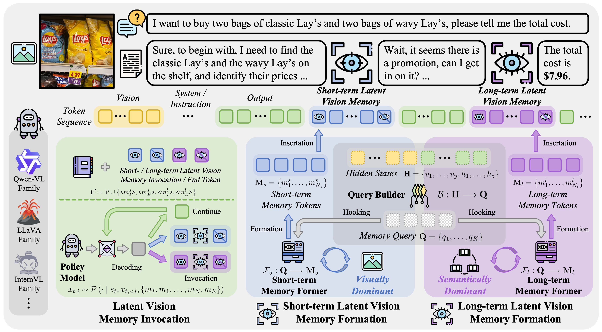
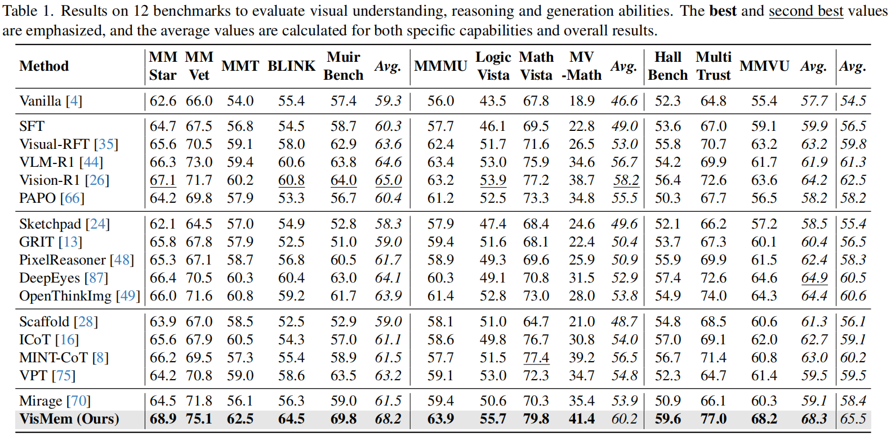
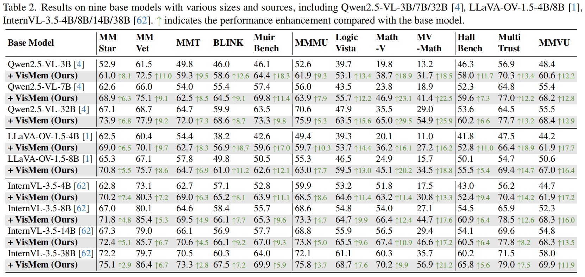
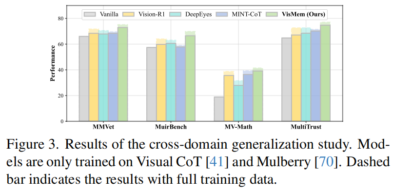
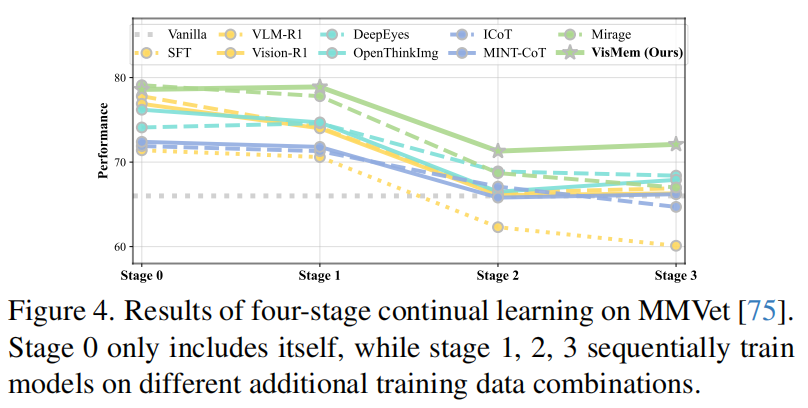
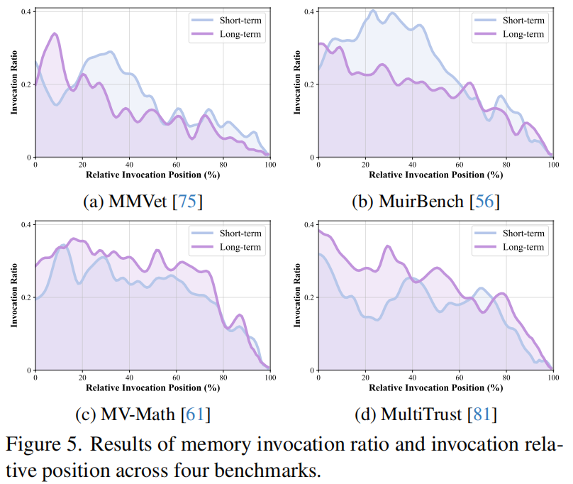
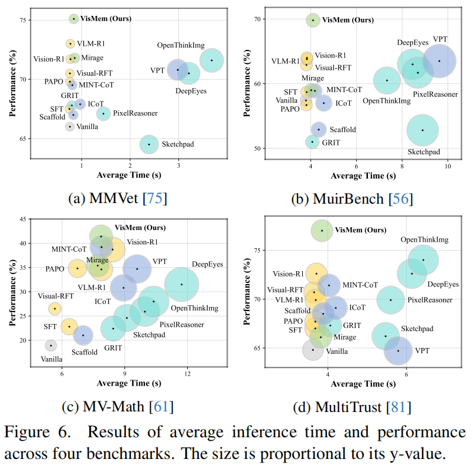

# VisMem: Latent Vision Memory Unlocks Potential of Vision-Language Models


## 🌟🌟🌟 Method
This repo is the official implementation of: [VisMem: Latent Vision Memory Unlocks Potential of Vision-Language Models](https://arxiv.org/abs/2511.11007).


Drawing inspiration from human cognitive memory theory, we propose a cognitively-aligned framework that equips VLMs with dynamic latent vision memories, a short-term module for fine-grained perceptual retention and a long-term module for abstract semantic consolidation.
These memories are seamlessly invoked during inference, allowing VLMs to maintain both perceptual fidelity and semantic consistency across thinking and generation.
<div style="text-align: center;">
  
</div>

## 🫡🫡🫡 Citation
```
@article{yu2025vismem,
  title={Vismem: Latent vision memory unlocks potential of vision-language models},
  author={Yu, Xinlei and Xu, Chengming and Zhang, Guibin and Chen, Zhangquan and Zhang, Yudong and He, Yongbo and Jiang, Peng-Tao and Zhang, Jiangning and Hu, Xiaobin and Yan, Shuicheng},
  journal={arXiv preprint arXiv:2511.11007},
  year={2025}
}
```

## 👍👍👍 Quick Start
### (1) Installation

```bash
conda create -n main python=3.10 -y
conda activate main
pip install -r requirements.txt
```


### (2) Training
Recommended GPU: >= 8 NVIDIA H200 141G GPUs.
#### Stage I
```bash
python -m main.cli.train_stage1 \
  --model_name_or_path Qwen/Qwen2.5-VL-7B-Instruct \
  --train_jsonl /path/to/train.jsonl \
  --output_dir outputs/stage1 \
  --epochs 1
```

#### Stage II
```bash
python -m main.cli.train_stage2 \
  --model_name_or_path Qwen/Qwen2.5-VL-7B-Instruct \
  --train_jsonl /path/to/train.jsonl \
  --init_from outputs/stage1 \
  --output_dir outputs/stage2 \
  --epochs 1
```


### (3) Evaluation
All datasets should use **JSONL** with fields, using "/data/jsonl_dataset.py". And utilize the inference process:
```bash
python -m main.cli.infer \
  --model path_to_model \
  --samples path_to_samples \
  --max_new_tokens 256 \
  --enable_vismem
```


## 🔥🔥🔥 Results
### Main Comparisons
<div style="text-align: center;">
  
</div>


### Results on Various Base Models
<div style="text-align: center;">
  
</div>


### Cross-domain Generalization

<div style="text-align: center;">
  
</div>


### Catastrophic Forgetting Mitigation

<div style="text-align: center;">
  
</div>


### Dynamic Memory Invocation

<div style="text-align: center;">
  
</div>


### Efficiency Analysis

<div style="text-align: center;">
  
</div>