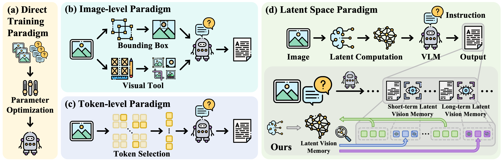

# VisMem: Latent Vision Memory Unlocks Potential of Vision-Language Models

## The source code will be publicly available soon...

## 📜 Existing Paradigms

  

## 🌟🌟🌟VisMem

  

## 🔥🔥🔥 Results
### Main Comparisons

  

### Results on Various Base Models

  

### Cross-domain Generalization

  

### Catastrophic Forgetting Mitigation

  

### Dynamic Memory Invocation

  

### Efficiency Analysis

  

